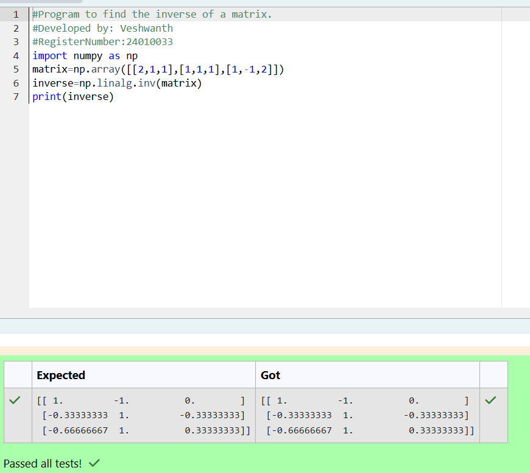

# INVERSE-OF-A-MATRIX
## Aim:
To write a python program to find the inverse of a matrix
## Equipment’s required:
1. 	Hardware – PCs
2. 	Anaconda – Python 3.7 Installation / Moodle-Code Runner
## Algorithm:
### Step1 :input Matrix 3x3 matrix as variable named matrix as nested list 
### Step 2:compute the nested list as determiant is non-zero,print,that the matrix is non-invertible abd stop. 
### Step 3:compute if the determinant is non-zero,use np.linalg.inv(matrix) to compute the inverse.
### Step 4:print the inverse matrix. 

## Program:

```
#Program to find the inverse of a matrix.
#Developed by: Veshwanth
#RegisterNumber:24010033
import numpy as np
matrix=np.array([[2,1,1],[1,1,1],[1,-1,2]])
inverse=np.linalg.inv(matrix)
print(inverse)
```


## Output:



## Result:
Thus the inverse of given matrix is successfully solved using python program

